**1.  Какая версия Docker Engine запущена на хосте?**  
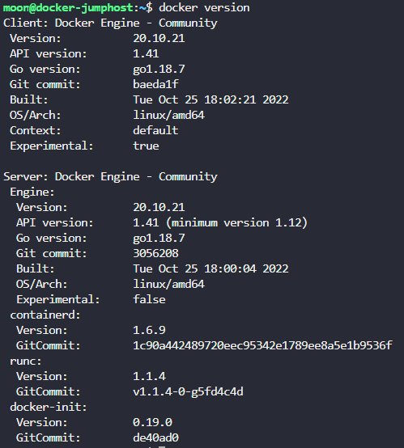  

**2. Сколько контейнеров запущено (RUNNING) на хосте?**  
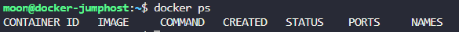  

**3. Сколько images доступно на хосте?**  
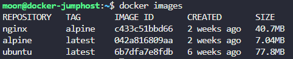  

**4. Запусти контейнер используя образ redis**  
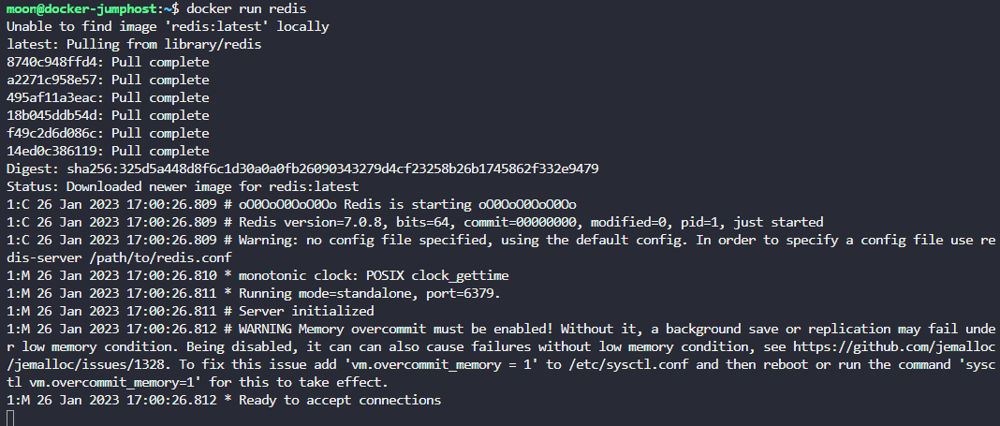  

**5. Останови только что созданный контейнер**  
> Ctrl+C

**6. Сколько контейнеров запущено (RUNNING) на хосте?**  
**ИНФО: Мы создали несколько контейнеров.**
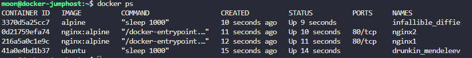  

**7. Сколько контейнеров всего (PRESENT) на хосте? Включая работающие и остановленные**
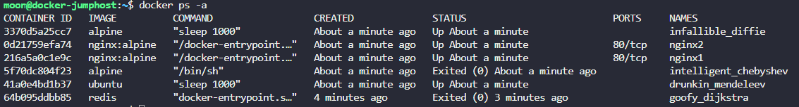  

**8. Какой образ использован для запуска контейнера nginx1?**  
> nginx:alpine  

**9. Какое название у контейнера созданного из образа ubuntu?**  
> drunkin_mendeleev 

**10. Какой ID у контейнера использующего образ alpine и в данный момент не работающего?**
> 5f70dc804f23  

**11. Какое состояние у остановленного контейнера с alpine?**
> Exited (0) About a minute ago  

**12. Удали все контейнеры с докер-хоста. 
Удали все: и Running, и Not Running. Не забудь, что перед удалением контейнеры надо остановить.**

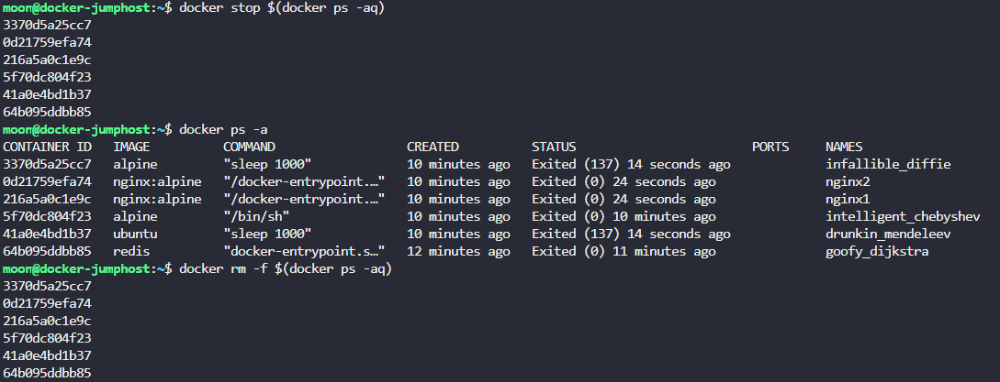  

**13. Удали образ ubuntu.**

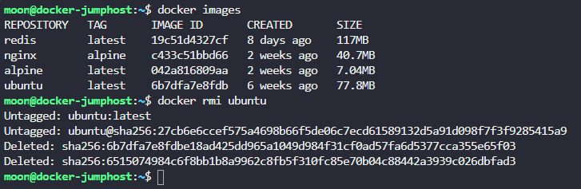  

**14. Тебе требуется докер-образ, который понадобится для запуска позже. Спулль образ nginx:1.14-alpine
Только скачай образ, не создавай контейнер.**

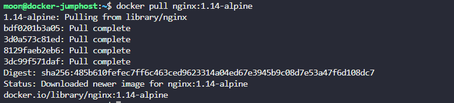  

**15. Запусти контейнер с образом nginx:1.14-alpine и дай ему имя webapp.**
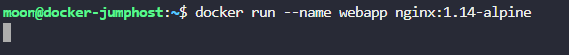

**16. Cleanup: Удали все images на хосте
Никаких образов не должно остаться.**
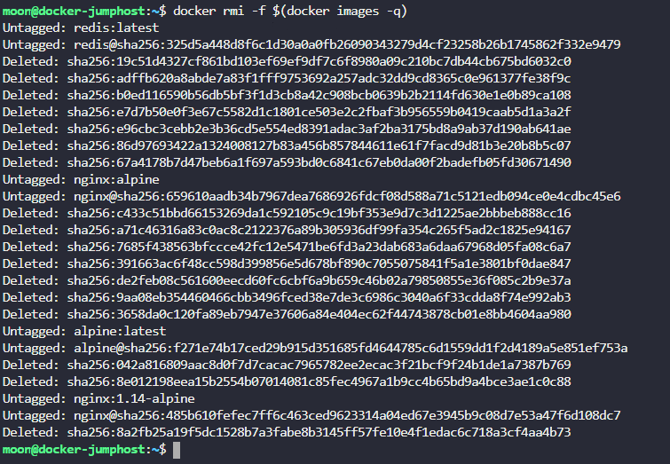  