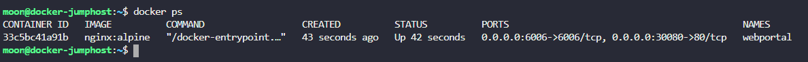
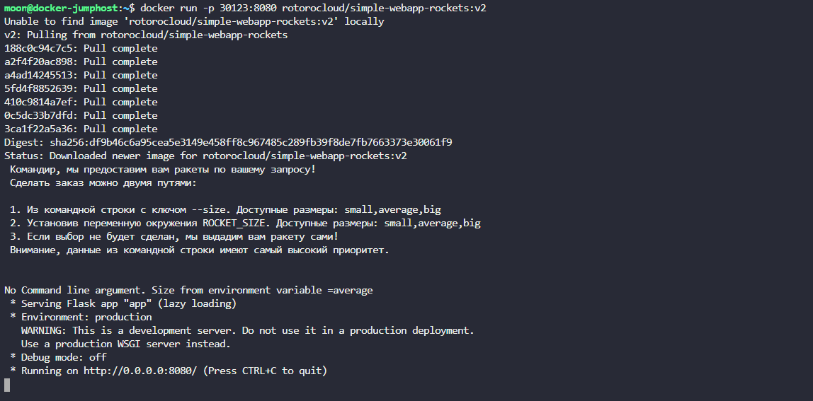
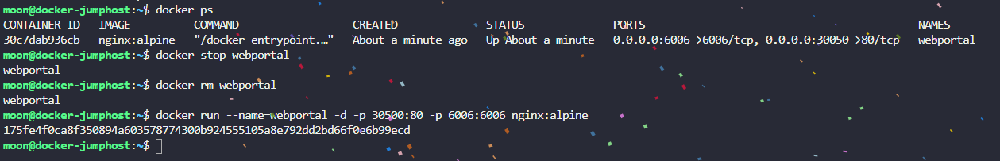
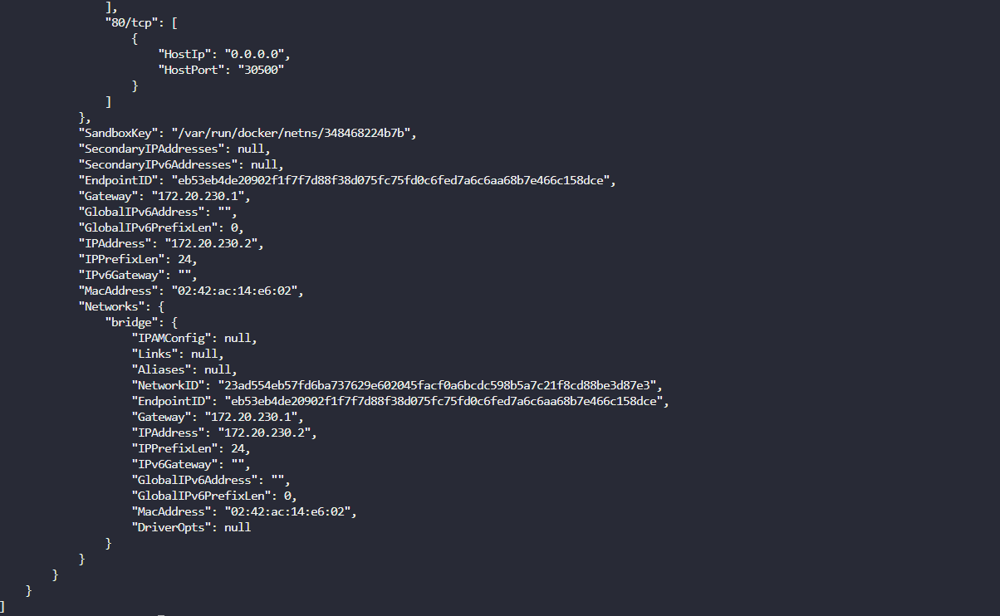
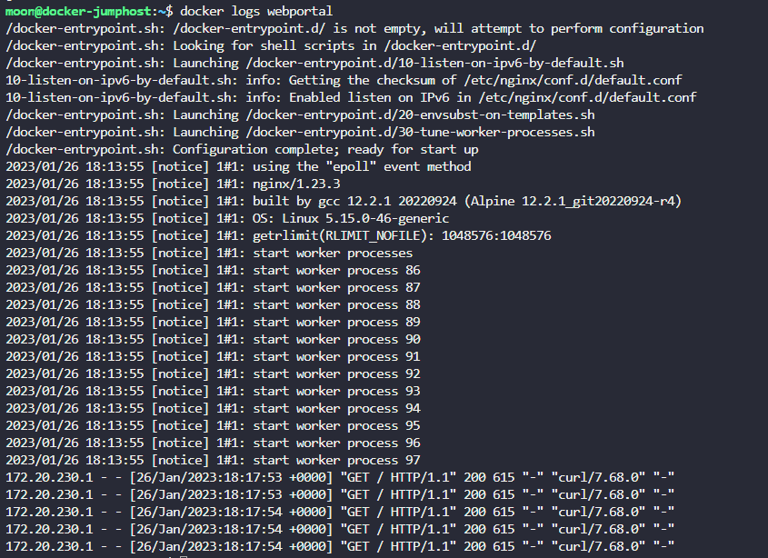

**1.  Вначале давай исследуем окружение. Сколько контейнеров запущено на хосте?**  
  
    

**2.  Какой образ использует контейнер?**    
> nginx:alpine

**3.  Сколько портов опубликовано у этого контейнера (только IPv4)?**  
> 2

**4. Какие номера портов выставлены в контейнер?**
> 80 & 6006

**5. Какие номера портов выставлены с хоста?**  
> 30080 & 6006

**6. Запусти контейнер rotorocloud/simple-webapp-rockets с тегом v2, соспоставь порт 8080 контейнера к порту 30123 хоста.**  

  

**7. Мы ошиблись при запуске контейнера webportal, его внешний порт должен быть 30500. Исправь это. Не забудь назвать его webportal.**  
Посмотри информацию о старом контейнере. Порты невозможно переопределить на запущенном контейнере.  

  

**8. Какой MacAddress адрес у контейнера webportal?**
> docker inspect webportal     

  

**9. Какой внутренний IP адрес у контейнера webportal?** 

>172.20.230.2

**10. Посмотри логи контейнера webportal**  
  
  