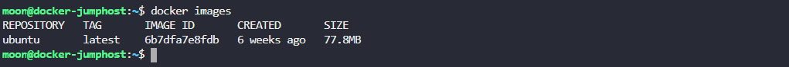
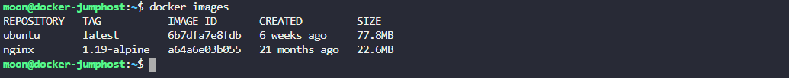
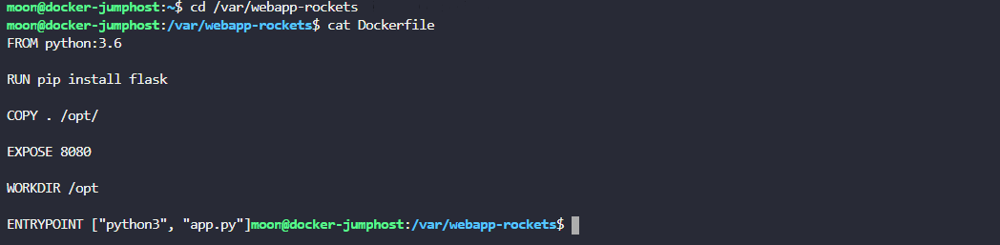
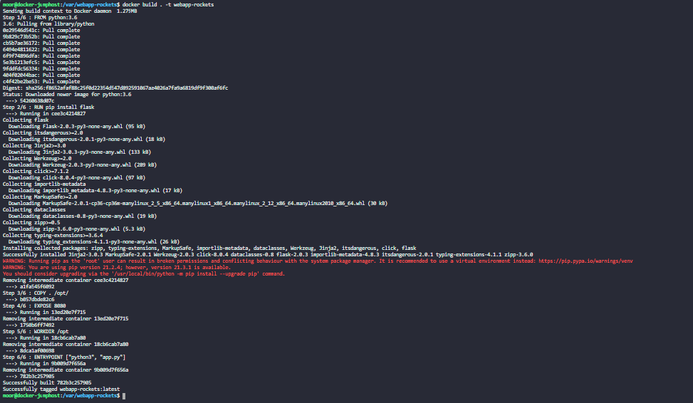
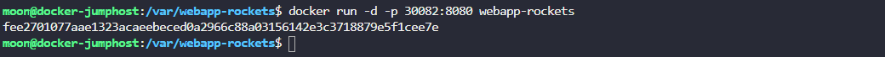
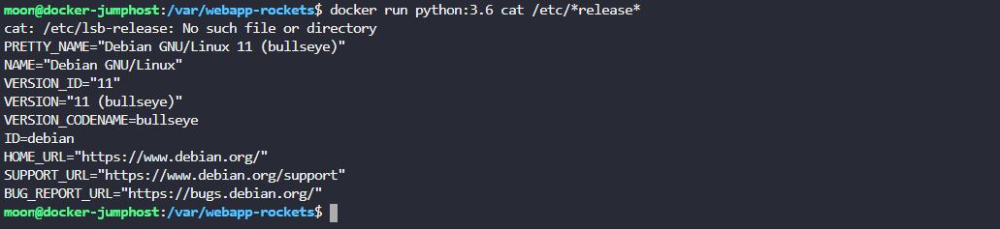
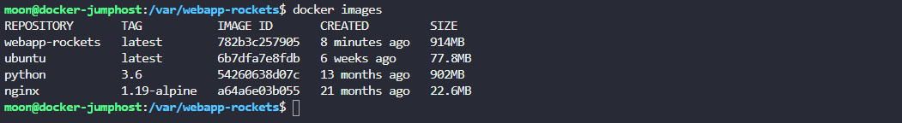
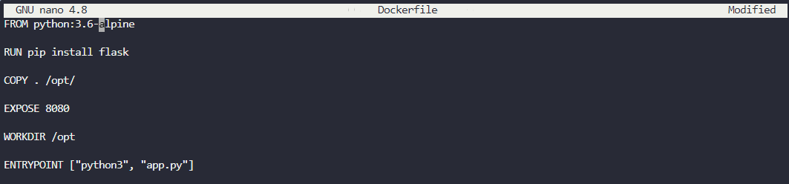
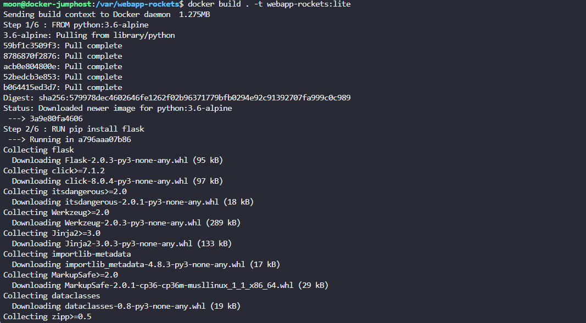
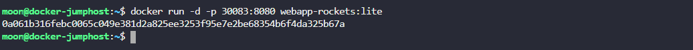

**1.  Сколько images доступно на докер-хосте?**  

     

**2.  Какой размер образа ubuntu?**  
  
 > 77.8 MB 

**3. Какой тег у нового образа NGINX?**  
ИНФО: Мы только что спуллили новый образ.  

> 1.19-alpine  

    

**4. Мы только что скачали код приложения. Какой базовый образ используется в этом Dockerfile?**  
Ищи Dockerfile в директории /var/webapp-rockets.
  
> python:3.6
  
    

**5. В какое расположение внутри контейнера будет скопирован исходный код во время создания образа?**  
Исследуй Dockerfile в директории /var/webapp-rockets.
  
> /opt
  
**6. Когда контейнер создан с помощью этого Dockerfile, какая команда используется для запуска приложения внутри него?**  
Исследуй Dockerfile в директории /var/webapp-rockets. 
  
> python3 app.py  

**7. Какой port у приложения внутри контейнера?**  
Исследуй Dockerfile в директории /var/webapp-rockets.  

> 8080  

**8. Создай докер-образ используя этот Dockerfile и назови его webapp-rockets. Не присваивай никаких тегов.**  
  
  

**9. Запусти экземпляр образа webapp-rockets и опубликуй порт 8080 контейнера на 30082 порту докер-хоста.**
  
  

**10. Какая базовая ОС использована в образе python:3.6?**  
Если потребуется, ты всегда можешь запустить такой контейнер.  
  
  

**11. Какой примерный размер образа webapp-rockets?**  
  
> 914 MB  
  
    

**12. Создай новый образ этого приложения, который будет поменьше. Измени старый Dockerfile, назови образ webapp-rockets, дай ему тег lite.**  
Поищи базовый образ поменьше для python:3.6. Убедись, что размер готового образа будет меньше чем 150MB.
Пароль для sudo - selena
> sudo nano Dockerfile  
  
   
  
   

**13.Запусти новый контейнер из образа webapp-rockets:lite и прокинь порт 8080 контейнера на порт 30083 докер-хоста.**    
  
  
