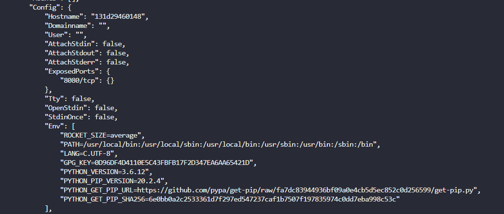
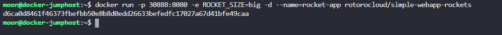
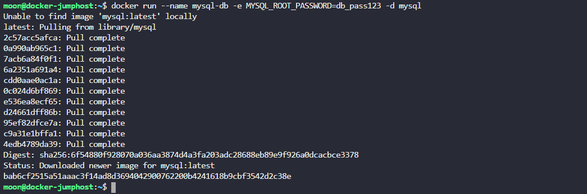
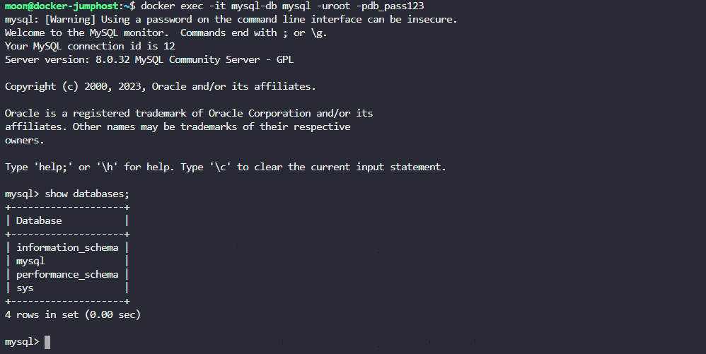
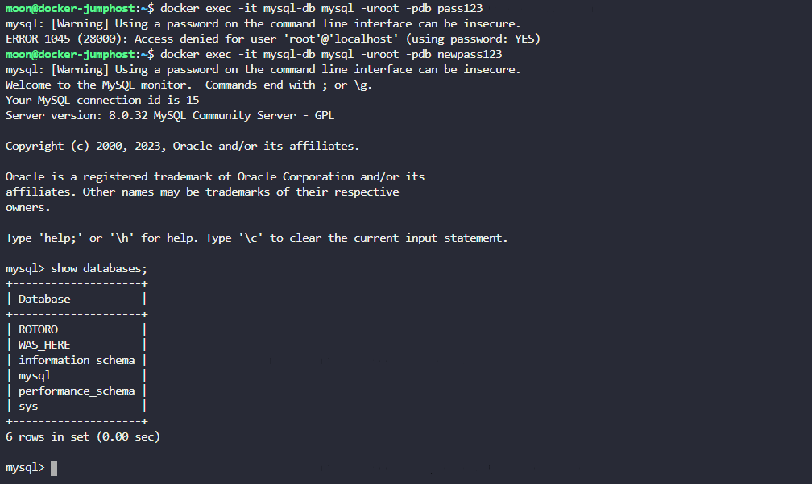

**1.  Исследуй переменные окружения в запущенном контейнере и определи значение переменной ROCKET_SIZE** 

  

**2. Запусти контейнер с именем rocket-app из образа rotorocloud/simple-webapp-rockets и установи переменную ROCKET_SIZE в значение big. Сделай приложение доступным на порту 30888 докер-хоста. Приложение в контейнере работает на 8080 порту.**  
  
    

**3. Разверни экземпляр базы mysql с помощью образа mysql и назови контейнер mysql-db.**  
Для этого контейнера установи пароль db_pass123. Ты можешь посмотреть правильный образ mysql на Docker Hub и там же узнать, как правильно проинициализировать root-пароль для ее контейнеризированной версии.  

  

**4. Узнай, сколько баз данных создано в контейнере с mysql**  
  
  

**5. Мы поменяли пароль в базе, но переменная осталась прежняя. Снова узнай, сколько баз данных создано в контейнере с mysql.**  
ИНФО: Новый пароль db_newpass123.
  
  