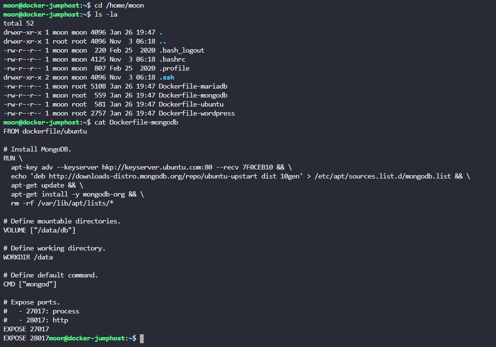
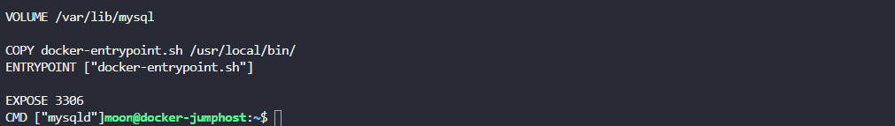
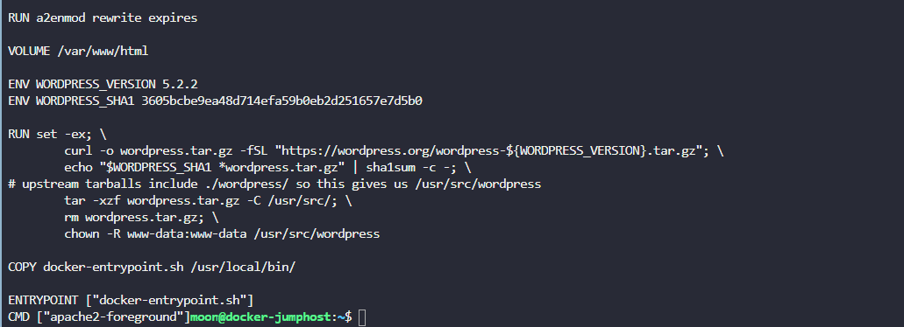
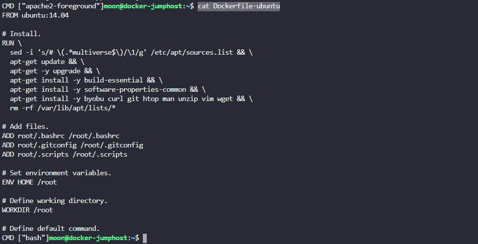
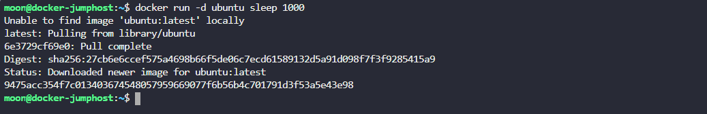

**Мы представили несколько Dockerfiles нескольких популярных продуктов в каталоге /home/moon/. Изучи их и ответь на несколько вопросов**  
  
**1. Какая ENTRYPOINT установлена для создания образа nosql базы данных?**  
  
  

**2. Какая ENTRYPOINT установлена для создания образа реляционной базы данных, коммюнити версии mysql?**  
  
>cat Dockerfile-mariadb  
  
    

**3. Какая CMD установлена для создания образа системы управления контентом wordpress?**  
  
>cat Dockerfile-wordpress  
  
  

**4. Какой будет окончательная команда при запуске контейнера из образа wordpress из данного Dockerfile? Прими во внимание и инструкцию ENTRYPOINT, и инструкцию CMD**  

>docker-entrypoint.sh apache2-foreground

**5. Какая команда выполняется при запуске контейнера, созданного из Dockerfile с названием ubuntu?**

  

**6. Запусти контейнер из образа ubuntu и переопредели команду (CMD) для старта в контейнере, заменив ее на sleep 1000**  
Запусти это в detached mode.
  
    
