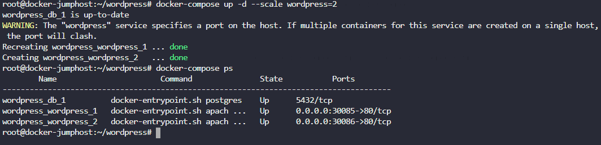

**1. Создай экземпляр базы данных postgres в контейнере с названием db, образ postgres, переменные окружения POSTGRES_PASSWORD=mysecretpassword**  
  
   

**2. Теперь создай простой контейнер с wordpress, он должен называться wordpress, образ: wordpress, сделай link этому контейнеру к контейнеру с именем db выставь 30085 порт на докер-хост**  
  
  

**3. Сначала надо прибрать за собой, давай удалим все, что осталось от предыдущих шагов.**  
Удали все контейнеры - db и wordpress  

  

**4. Создай файл docker-compose.yml в размещении /root/wordpress. Обрати внимание, размещение должно быть /root/wordpress/docker-compose.yml, иначе система не сможет правильно проверить результат. Сделай sudo -i, пароль selena. После этого запусти стек с помощью docker-compose в detached mode.**  
Важно, чтобы в файле спецификация была такой же, как и раньше, т.е. контейнеры были wordpress и db и не забудь прокинуть нужные порты

   

**5. Мы что-то поменяли, сколько реплик контейнеров в службе wordpress?**  
  
    

**6. Увеличь количество реплик wordpress до 2.**  
Пользуйся средствами docker-compose
  
  

**7. Останови стек docker-compose.**
Убедись, что Docker Compose корректно положил стек  
  
  