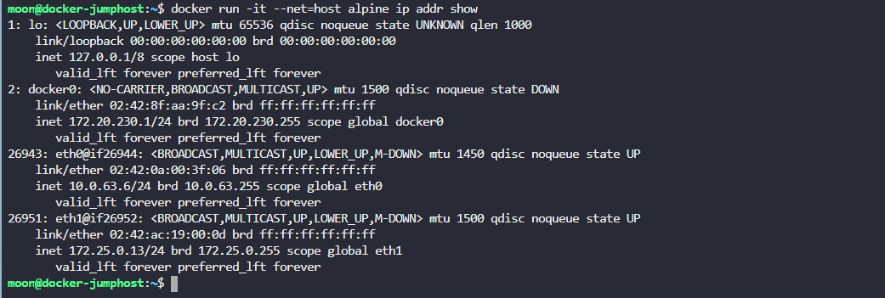
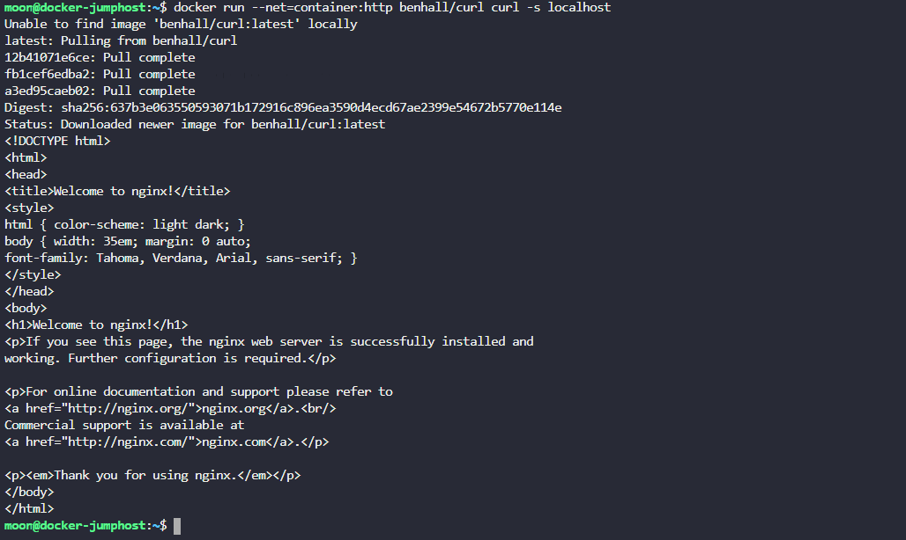

**1. Запусти контейнер с названием alpine-100mb из образа alpine, ограничив его память 100mb.**  
Не забудь, что alpine это ОС, внутри должна работать какая-то команда.  
Проверить себя ты можешь с помощью команды docker stats --no-stream  
  
  

**2. Какой из контейнеров был ограничен примерно 50% процессорного времени для своего выполнения?**  
Запусти скрипт в размещении /home/moon/cpu-stress.sh  
  
  

**В отличие от памяти, ограничения CPU основаны на доле совместного времени обработки процесса. Таким образом, можно приоритезировать самые важные процессы, а на не критические выделять CPU по остаточному принципу. Есть несколько способов разделить ресурсы, здесь мы воспользовались инструкцией --cpu-shares. Ты можешь изучить код в скрипте**  
И да, в самом деле, в скрипте для контейнера stress75 установлена планка 75%, но из-за особенностей виртуализации нашей песочницы, это работает на 50%. В чистом docker будет 75%.
  
**3. Запусти команду:** 
> docker run -it alpine ip addr show  
  
**Сколько сетевых интерфейсов у контейнера (включая loopback)?**
  
В то время, как cgroups контролируют, сколько ресурсов может получить контейнер, namespaces управляют тем, что контейнер может видеть и к чему получить доступ.

  

**4. Запусти команду:**  
> docker run -it --net=host alpine ip addr show  

**Сколько теперь сетевых интерфейсов у контейнера (включая loopback)?**

 Первая команда запускала контейнер в обычном режиме изоляции, а вторая в NET-пространстве хоста  

  
  
В выводе команд наглядно видно, что внутри контейнера существует единственный виртуальный eth-интерфейс (не считая loopback), но при отключении NET-изоляции контейнер получает доступ ко всем сетевым устройствам своего докер-хоста.

**5. Запусти команды:**  
>docker run -it alpine ps aux  
> docker run -it --pid=host alpine ps aux  
  
Первая команда запускает контейнер в обычном режиме изоляции, а вторая в PID-

  
  
В выводе команд наглядно видно, что дерево процессов в контейнере при PID-изоляции подменяется фейковым деревом.  

**6.Запусти контейнер в detached mode с именем http из образа nginx:alpine**  
  
Иногда для целей отладки мы можем предоставить контейнеру доступ в namespaces докер-хоста. Это считается плохой практикой, поскольку мы разрушаем всю модель безопасности Docker. Вместо этого, мы можем предоставить интструментам профилирования доступ в namespaces, связанных с контейнером.  

  
  
**7. Запусти команду:**  
> docker run --net=container:http benhall/curl curl -s localhost
  
Контейнеры-отладчики теперь могут использовать пространство имен контейнера http. Они окажутся как бы в одной песочнице, и новый контейнер сможет обратиться к веб-серверу просто через localhost.  
  
    

**78. Запусти команду:**  
> docker run --pid=container:http alpine ps aux
  
Та же история с процессами, их можно сделать общими. Например, ты можешь залезть в контейнер и исследовать его с помощью strace. И тебе не потребуется ставить дополнительное ПО в контейнер, останавливать контейнер и перезапускать приложение в нем.

  

