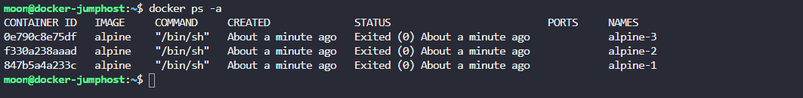
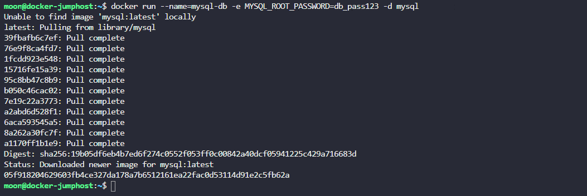
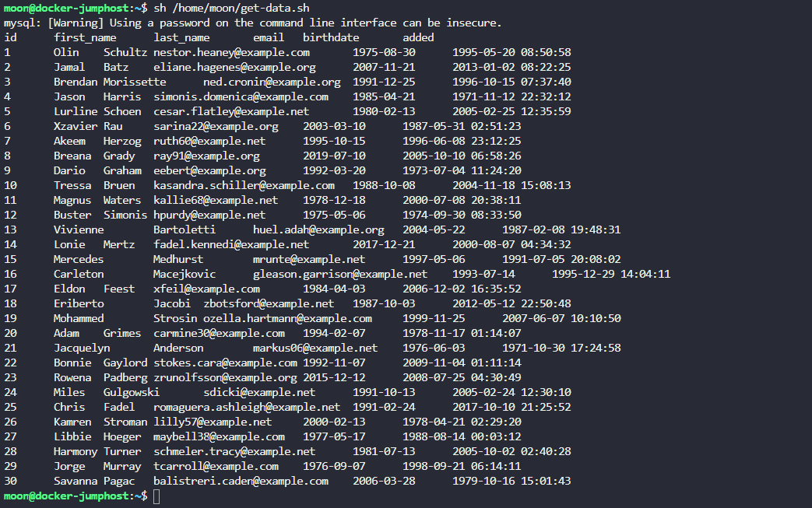
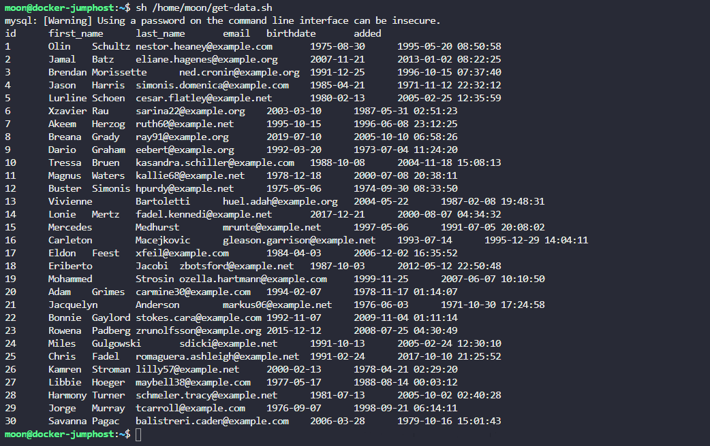
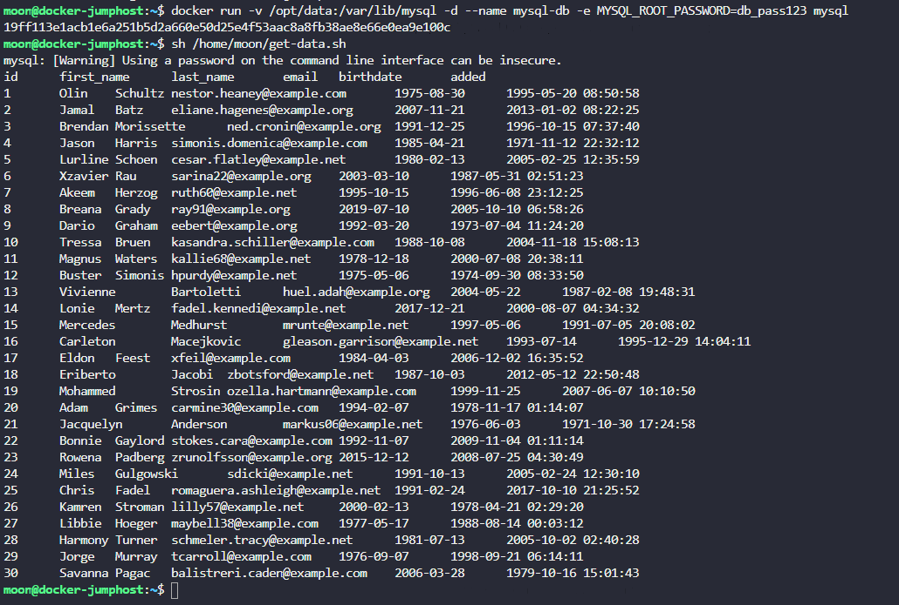

**1. В каком месте находятся файлы, связанные с докер-контейнерами и докер-образами?**  
>  /var/lib/docker
  
**2. В какой папке внутри директории /var/lib/docker/containers лежат файлы связанные с образом, от которого запущен контейнер alpine-3**   
  
> Название директории тоже самое, что и ID контейнера.
  
  

**3. Запусти контейнер с mysql и дай ему имя mysql-db (используй образ mysql). Установи ROOT-пароль к базе данных в db_pass123**

  

**4. Мы только что записали данные в базу mysql. Чтобы просмотреть содержимое воспользуйся скриптом get-data.sh, он доступен в директории /home/moon. Сколько клиентских записей присутствует в базе?**

 

**5.База данных сломалась. Ты можешь просмотреть данные сейчас?
Попробуй посмотреть данные той же командой. Попробуй найти контейнер.**
> No
  
  

**5. Запусти mysql-контейнер снова, но в этот раз подключи том (volume) к контейнеру. В томе данные будут на постоянном хранении по размещению /opt/data хоста.**
Используй тоже самое имя: mysql-db и тот же пароль: db_pass123, как и ранее. Mysql хранит даные в /var/lib/mysql внутри контейнера.

  

**6. Мы только что снова записали данные в базу. Запусти скрипт get-data.sh, чтобы убедиться, что они на месте.**

 

**7. У нас снова падение! Все контейнеры снова уничтожены. Но теперь все наши данные хранятся в директории /opt/data. Разверни БД в новом экземпляре mysql, используя те же параметры.**

  