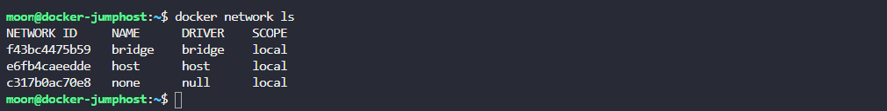
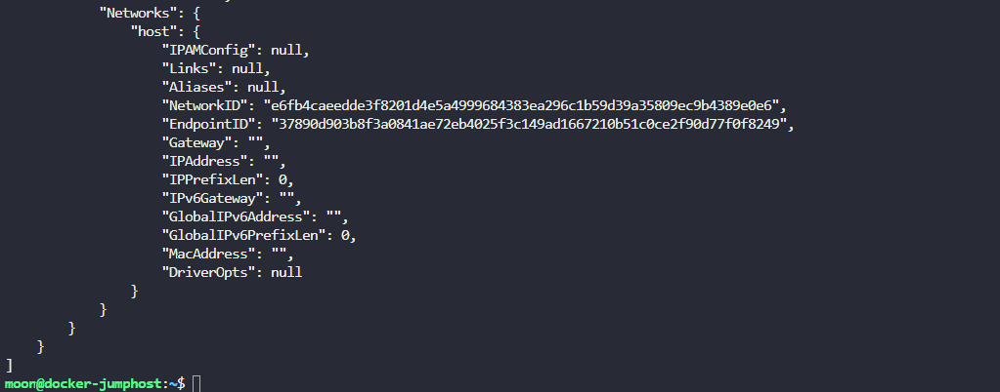
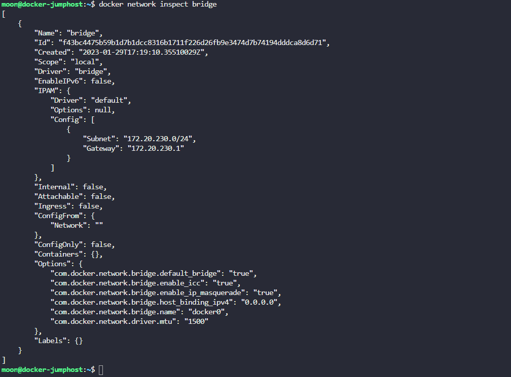
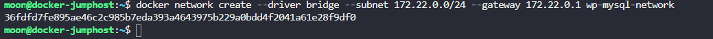
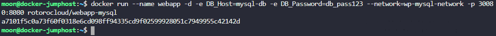

**1.Исследуй текущее окружение Docker и определи, какое количество networks присутствует в системе**  

  

**2. Какой ID соответствует мостовой сети (bridge network)?**

> f43bc4475b59b1d7b1dcc8316b1711f226d26fb9e3474d7b74194dddca8d6d71  

**3. Мы только что запустили контейнер с названием alpine-1. Определи к какой сети он присоединен.**
  
> docker inspect alpine-1
  
    

**4. Какая подсеть сконфигурирована в сети bridge?**
  
> docker network inspect bridge
  
    

**5.Запусти контейнер с названием alpine-2 с помощью образа alpine и прикрепи его к сети none.**  
  
  

**6. Создай новую сеть с названием wp-mysql-network, которая будет использовать сетевой драйвер bridge. Назначь ей 172.22.0.0/24 подсеть. Настрой Gateway 172.22.0.1**

  

**7. Разверни базу mysql с помощью образа mysql. Контейнер должен называться mysql-db. Прикрепи его к только что созданной сети wp-mysql-network**

  

**8. Разверни веб-приложение с названием webapp, используй образ rotorocloud/webapp-mysql. Выставь (Expose) порт 30080 на хост. Приложение использует переменную окружения DB_Host в качестве имени хоста базы данных mysql. Убедись, что прикрепил вновь созданную сеть wp-mysql-network**

  